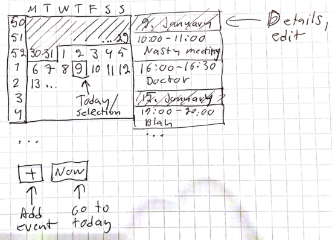

# Allacca UI design draft

## The main view

Main view consists of two columns which are both infinitely scrollable in both directions. 

The left side is the week/day calendar. It also shows month limits by applying slightly different colors to even and odd months. Otherwise there is no indication of month changes (no jumping or snapping into nasty positions on month boundaries). 

The right side is the event list/agenda. The list starts from the selected day of calendar view. By default the selected day is the current day. If the user touches week number instead of a day, the the first day of the week is selected.

### Main view actions

* Adding an event is done either by long-pressing a day or pressing the "+"-button. The add event view will use the selected day to prefill the day of the event.
* Pressing the "now"-button will throw you back to the current day. Helpful if you've e.g. scrolled to year 3005 and want to go back quickly.
* Editing an event happens by pressing the event on the right hand side. 

Event Add/Edit view
-------------------

Same view is used to add and edit a calendar event. 

Everything is entered as plain digits. No scrollers, no bullshit.

Day is prefilled as described earlier (based on the selection), time will be the prefilled as the current time. 

*Note: image is missing save/cancel buttons which will be at the bottom.*

